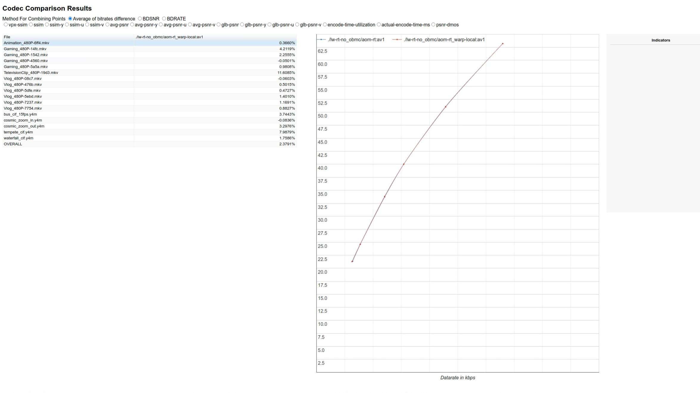

# AV1 Open Source Codec Comparison

AOMedia Video 1 (AV1) is an open, royalty-free video coding format designed for video transmissions over the Internet. AV1 provides a set of state-of-the-art video compression tools that can compress the high quality video signals with high efficiency, without requiring licensing fees. libaom is the official software implementation of the AV1 coding standard. Besides libaom, there are two other popular AV1 compliant open source libraries, the Scalable Video Technology for AV1 (SVT-AV1) and Rust AV1 encoder (RAV1e). These codecs have their own features, for example, multi-thread encoding, faster encoding speed... The goal of this project is to, under certain use cases configurations, compare the coding tools in SVT-AV1 and RAV1e to libaom with regard to different coding quality metrics and speed, to provide insight into improvements which could be made to libaom or to proprietary AV1 encoders.

This repo contains the code that was used for this project. It mainly comprises of the perfomrance metric tool for evaluating the quality and speed of the encoders and git diffs for the experiments/code changes that were worked on during the project.

The experiment git diffs can be found in the [experiments branch](https://github.com/googleinterns/av1-codec-comparison/tree/experiments)

The folder `rtc-video-quality` is a [fork](https://github.com/google/rtc-video-quality) that was tweaked to make use of the AV1 encoders and use a template html to generate the graphs. You can learn more about it by reading the [readme](rtc-video-quality)

## rtc-video-quality
rtc-video-quality is a public repo that is currently maintained by Google. Although it is inactive, its scripts are fairly easy to understand and things can be handled much better. It is currently inactive and it’s a bit old. Here are the following pointers to note

### How it works
You have two scripts:

* generate_data.py 
  * format: `./generate_data.py --out={metrics_data.txt} --encoders={lib1:enc1, lib2:enc2} {--enable-vmaf} video_file --workers {worker_num}`
  * This will run the codecs installed and encode the video in different formats. During the encoding, metric tools will be run through to analyze the result of the output video. The final result will be stored in the text file as a json
* generate_graph.py
  * format: `./generate_graphs.py --out-dir {graph_dir} {metrics_data.txt}`
  * Given a json file of the result, this script will generate graphs using matplotlib from the results of the json file. The plots will be stored in different images provided in the out-dir. The format of the images will be png and svg

### Metrics measured

* avg-psnr
* avg-psnr-(u,v,y)
* ssim-(u,v,y)
* actual-encode-time-ms
* vmaf (optional)
* glb-psnr-(u,v,y)
* glb-ssim(u,v,y)
* vpx-ssim

### Usage
#### generate_data.py
To generate graph data (after building and installing dependencies), see:

`./generate_data.py --help`

Example Usage:

`./generate_data.py --out=libvpx-rt.txt --encoders=libvpx-rt:vp8,libvpx-rt:vp9 video.y4m`

You can also specify the number of workers(threads) to run the encoders. By default, the number of  workers is the number of processors your CPU has

#### generate_graphs.py
To generate graphs from existing graph data run:

`./generate_graphs.py --out-dir OUT_DIR graph_file.txt [graph_file.txt ...]`

This will generate a results.html file within the out-dir that shows a graph of different metrics that were measured. Here's an example html screenshot:

### Tweaks Made
We had to make some tweaks in order to use this repo for our project. The code for this can be found here

Here are some tweaks made

#### Conversion from python2 to python3
Since python2 is deprecated and no longer supported, we will be converting the all the code used to python3. Used a tool (2to3) to convert most of the print/dictionary statements to python3. With python3, some of the functions such as subprocess.check_output returned bytes by default instead of string. Thus we had to manually add encoding to utf-8 in subprocess commands.

#### Refactoring code
There were mainly two scripts. The script for generating data needed to be tweaked since we will be adding more encoder configurations. Thus, it will be clunky to have everything in one file. We split generate_data.py into three files: 

* encoder_commands.py
  * This file contains the configurations to run for all the different encoders. It contains functions you call, that will return a command that you can pass through subprocess.Popen calls
  * If you want to add any new configurations, refer to this file
* binary_vars.py
  * This file contains all the binaries that were installed through the setup scripts. They will be used in encoder_commands.py and generate_data.py
  * If you want to add/edit any binaries installed using the setup script, refer to this file
* generate_data.py
  * This is the main script that contains everything else from preparing the clips, generating the jobs to running the encoders to generating the metrics
  
#### Add new encoders to scripts
Given our project will be using the open source tools for av1, setup scripts for rav1e and svt were added so that we can use them for metric analysis. The setup script for aom checked out a very old commit and was not able to decode the videos encoded by rav1e and svt. Thus, we updated the git checkout to one of the recent versions and modified the setup commands to reflect the current way of setting up aom

So we added two new files:

* setup_rav1e.sh
* setup_svt.sh

#### New encoder configurations
To get rav1e and svt working and to also add the configurations from the project, we added new configurations for aom, rav1e and svt including offline configs for aom and rt configs for aom, rav1e and svt. 

We ran into the issue of rav1e being the only encoder that accepts y4m formats instead of yuv. Thus, in preparing the clips, we added a step to convert the videos to y4m so that they can be taken in by rav1e

#### Using HTML template instead of png/svg outputs
The generate_graph.py script originally generated graphs using matplotlib. However, the plots were stored in different images in the svg, png format. This was a bit clumsy to read and analyze the data. 

We adapted the script from aom's visual_metrics using their template file to generate the html metrics. This process involved creating relevant files for every video encoded by the encoder in a tab spaced format and then passing it to the visual_metrics script

#### Using QP-Rate instead of Target Bitrate
By default, the script encoded videos at different target bitrates. Given that our project also requires the ability to encode at different QP values, we had to modify the script to use qp values instead of target bitrate. This also meant that we had to modify some of the functions in generate_graphs.py since they were using target-bitrate in their graphs instead of actual bitrate
